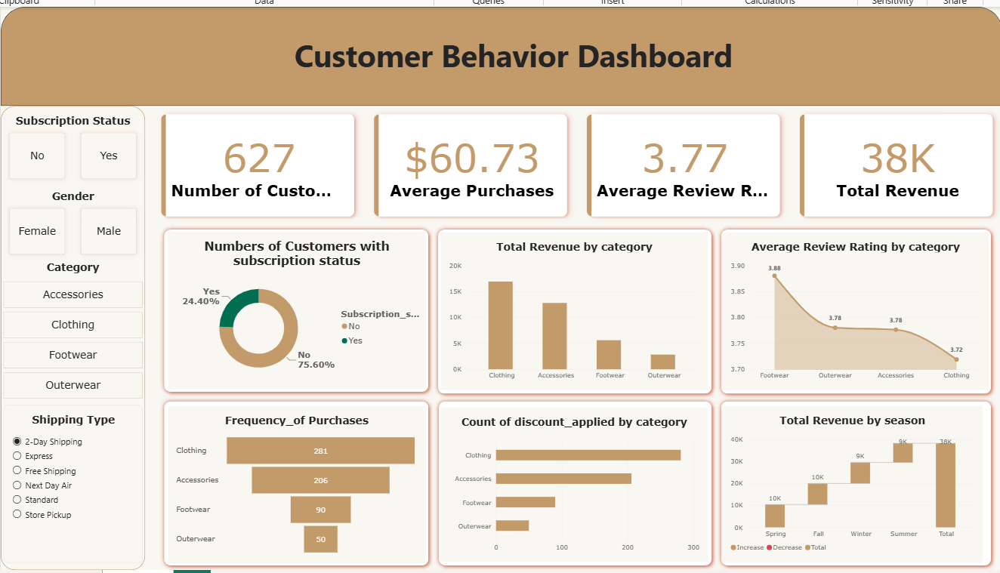

# 🛍️ Customer Behavior & Shopping Trends Analytics Dashboard

An end-to-end data analytics project exploring customer purchasing patterns, demographics, product categories, and revenue trends using **Python**, **MySQL**, and **Power BI**.

---

## 📊 Dashboard Preview

---

## 🚀 Project Overview
Understanding customer behavior is crucial for optimizing retail strategies, inventory management, and targeted marketing. This project takes raw customer shopping data, cleans and transforms it, stores it in a relational database, and brings insights to life through an interactive, executive-ready **Power BI Dashboard**.

---

## 🛠️ Tech Stack & Tools
* **Data Preprocessing & Cleaning:** Python (Pandas, NumPy)
* **Database & Querying:** MySQL (Data Storage & Structured Queries)
* **Data Visualization & BI:** Power BI (DAX measures, interactive slicers, custom themes)
* **Version Control:** Git & GitHub

---

## 📈 Key Performance Indicators (KPIs) & Metrics
The dashboard highlights essential retail metrics at a glance:
* **Total Customers:** 627[cite: 1]
* **Average Purchases:** $60.73[cite: 1]
* **Average Review Rating:** 3.77 / 5.0[cite: 1]
* **Total Revenue:** $38,000 (38K)[cite: 1]

---

## 🔍 Key Insights & Visual Breakdown

1. **Subscription Status:** 
   * **75.60%** of customers do not have an active subscription, while **24.40%** are subscribed[cite: 1], highlighting a major growth opportunity for loyalty programs.
2. **Revenue by Category:** 
   * **Clothing** generates the highest total revenue, followed closely by Accessories, Footwear, and Outerwear[cite: 1].
3. **Ratings vs. Categories:** 
   * Footwear leads in customer satisfaction with an average review rating of **3.88**, compared to Clothing at **3.72**[cite: 1].
4. **Frequency of Purchases:** 
   * Clothing and Accessories dominate purchase frequency counts among the customer base[cite: 1].
5. **Discount Utilization & Seasonality:** 
   * Tracks discount applications across categories and visualizes cumulative seasonal revenue progression (Spring, Fall, Winter, Summer) totaling **38K**[cite: 1].

---

## 🎛️ Interactive Dashboard Filters (Slicers)
The Power BI report includes dynamic filtering capabilities allowing stakeholders to slice data by:
* **Subscription Status** (Yes / No)[cite: 1]
* **Gender** (Female / Male)[cite: 1]
* **Product Category** (Accessories, Clothing, Footwear, Outerwear)[cite: 1]
* **Shipping Type** (2-Day Shipping, Express, Free Shipping, Next Day Air, Standard, Store Pickup)[cite: 1]

---
